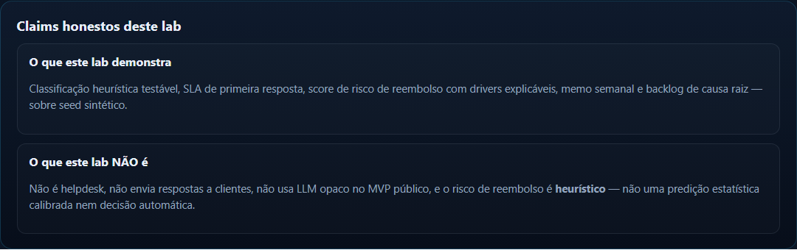

# SupportSignal

**Tagline:** Camada de inteligência para suporte pequeno — classifica mensagens, mede SLA, aponta risco de reembolso e transforma sintomas em causa raiz.


<p align="center">
  <a href="https://supportsignal-lab-lake.vercel.app"><strong>Live Demo</strong></a>
  ·
  <a href="https://github.com/BarujaFe1/SupportSignal"><strong>GitHub</strong></a>
  ·
  <a href="https://barujafe.vercel.app"><strong>Portfólio</strong></a>
</p>

> **Lab scope:** demo pública frontend-first com seed sintético. Heurísticas explicáveis + revisão humana. **Não** é helpdesk e **não** é “IA que resolve suporte” sozinha.

---

## Problema real

Pequenas operações (SaaS, e-commerce, infoprodutos, escolas) atendem no Gmail/WhatsApp/helpdesk simples e acumulam sintomas: cobrança confusa, onboarding ruim, bugs, atraso, pedido de reembolso. O time gasta tempo todos os dias sem ver causa raiz, SLA quebrado ou fila de risco.

## Solução

SupportSignal é uma **intelligence layer** sobre o suporte existente:

1. importa/carrega inbox (demo seed ou CSV local via API);
2. classifica temas com regras configuráveis;
3. mede primeira resposta e breaches de SLA;
4. pontua risco de reembolso com drivers explicáveis;
5. agrega causa raiz + memo semanal + backlog de ações.

## Principais funcionalidades

- **Demo one-click** com 240 mensagens sintéticas
- **Topic classifier** (billing, refund, bug, onboarding, delivery, …)
- **SLA dashboard** (média de 1ª resposta + taxa de breach)
- **Refund risk board** (score ≥ 70 + drivers)
- **Root-cause explorer** e **weekly memo**
- **Action backlog** priorizado (P0–P2)
- **FastAPI local** com upload CSV validado

## Arquitetura

```text
CSV / Demo JSON
  → classify (heuristics)
  → SLA + refund risk
  → topics / memo / actions
  → Next.js cockpit (Vercel)  |  FastAPI (local)
```

Detalhes: [`docs/ARCHITECTURE.md`](./docs/ARCHITECTURE.md) · decisões: [`docs/TECHNICAL_DECISIONS.md`](./docs/TECHNICAL_DECISIONS.md)

## Stack

| Camada | Tecnologia |
|---|---|
| Lab UI | Next.js 15, React 19, TypeScript, Recharts |
| Browser engine | TypeScript heuristics (`apps/web/lib/engine`) |
| API | FastAPI, Pydantic, Pandas, Pytest |
| Deploy | Vercel (`apps/web`) |

## Demo local

### Lab frontend-first (mesmo modo da Vercel)

```bash
cd apps/web
npm install
npm run dev
```

Abra [http://localhost:3000](http://localhost:3000) e use **Carregar demo one-click**.

### Windows integrado (web + API)

```bash
start.bat
```

### API FastAPI

```bash
cd apps/api
python -m venv .venv
.venv\Scripts\activate   # Windows
pip install -r requirements.txt
uvicorn app.main:app --reload --port 8000
```

## Variáveis de ambiente

Veja [`.env.example`](./.env.example). A demo pública **não exige secrets**.  
`NEXT_PUBLIC_API_URL` e `CORS_ORIGINS` importam só no modo dual local.

## Testes

```bash
# API
cd apps/api && pytest -q && ruff check app tests

# Web
cd apps/web && npm test && npm run typecheck && npm run lint && npm run build
```

Parity Python↔TS: golden cases em [`data/fixtures/classifier_parity.json`](./data/fixtures/classifier_parity.json).

Guia: [`docs/TESTING.md`](./docs/TESTING.md) · Deploy: [`docs/DEPLOYMENT.md`](./docs/DEPLOYMENT.md) · Demo 3–5 min: [`docs/DEMO_SCRIPT.md`](./docs/DEMO_SCRIPT.md)

## Claims permitidos vs proibidos

| Permitido | Proibido |
|---|---|
| Lab de intelligence layer com heurísticas | “IA que resolve suporte” |
| Risco de reembolso **heurístico** com drivers | Predição ML calibrada / decisão automática |
| Seed sintético + mascaramento | Dados reais de clientes na demo pública |
| FastAPI local + upload CSV | Helpdesk completo / auto-reply em produção |

## Decisões técnicas e trade-offs

- Heurísticas antes de LLM opaco → explicabilidade e custo previsível
- Frontend-first na Vercel → demo estável sem hospedar Python
- Dual engine Python/TS → risco de drift mitigado por testes em ambos os lados
- Seed sintético → privacidade e reprodutibilidade

## Roadmap

- **Agora (lab MVP):** seed, classifier, SLA, refund risk, memo, CI/docs
- **Fase 2:** conectores (Gmail/Zendesk/WhatsApp), alertas de spike, replies sugeridas com aprovação humana
- **Fase 3:** workflow de melhoria de produto, near-real-time, benchmarking

Non-goals iniciais: helpdesk completo, auto-atendimento sem revisão, dependência cega de LLM.

## Status atual

| Item | Status |
|---|---|
| Live demo | Pública (Vercel lab) |
| Seed sintético | 240 msgs |
| API local | Estável + testes de upload |
| CI | GitHub Actions |
| Auth / billing | Fora do lab |

## O que este projeto demonstra

- Produto B2B com tese clara (intelligence layer)
- NLP/classificação pragmática e testável
- Analytics operacional acionável (SLA, risco, causa raiz)
- Responsabilidade: mascaramento, caveats, human review
- Entrega full-stack (Next + FastAPI) com demo pública

## Como eu apresentaria em entrevista

1. Abrir Live Demo e o banner de escopo (lab ≠ helpdesk).  
2. One-click → mostrar topics + SLA breach.  
3. Abrir refund risk board e ler **drivers** (explicabilidade).  
4. Fechar no weekly memo / action backlog (de sintoma → ação).  
5. Explicar trade-off: heurística primeiro; LLM só com revisão humana depois.

## Screenshots

Capturas reais do lab (seed sintético, sem PII). Manifesto: `assets/screenshots/CAPTURE_MANIFEST.json`.

<p align="center">
  
</p>

<table>
  <tr>
    <td><br /><sub>Refund risk board</sub></td>
    <td><br /><sub>Weekly memo</sub></td>
  </tr>
  <tr>
    <td><br /><sub>Topic classifier</sub></td>
    <td><br /><sub>Claims honestos</sub></td>
  </tr>
</table>

## Autor

**Felipe Alirio Baruja** · [Portfólio](https://barujafe.vercel.app/) · [GitHub](https://github.com/BarujaFe1) · [LinkedIn](https://www.linkedin.com/in/barujafe/)

## Licença

MIT · Copyright (c) 2026 Felipe Alirio Baruja
