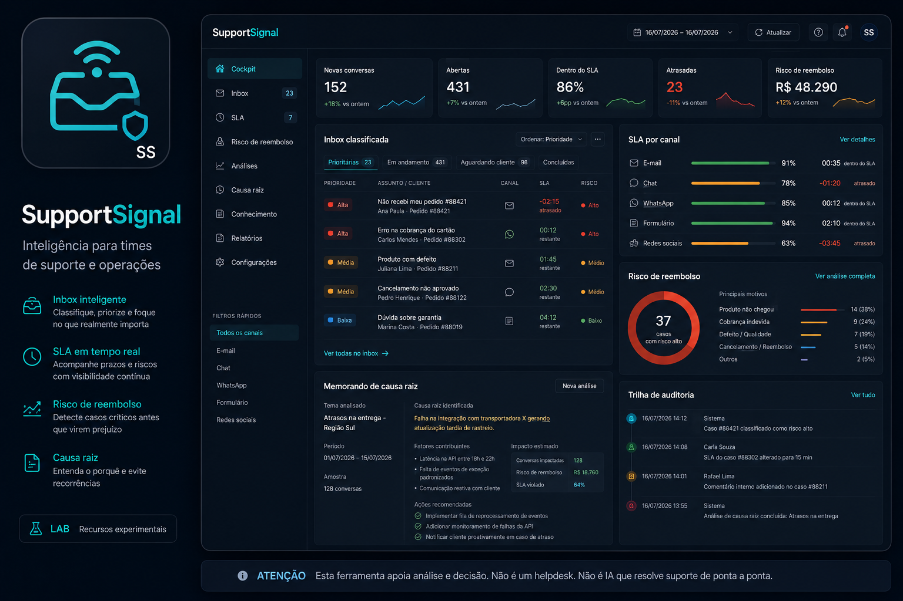
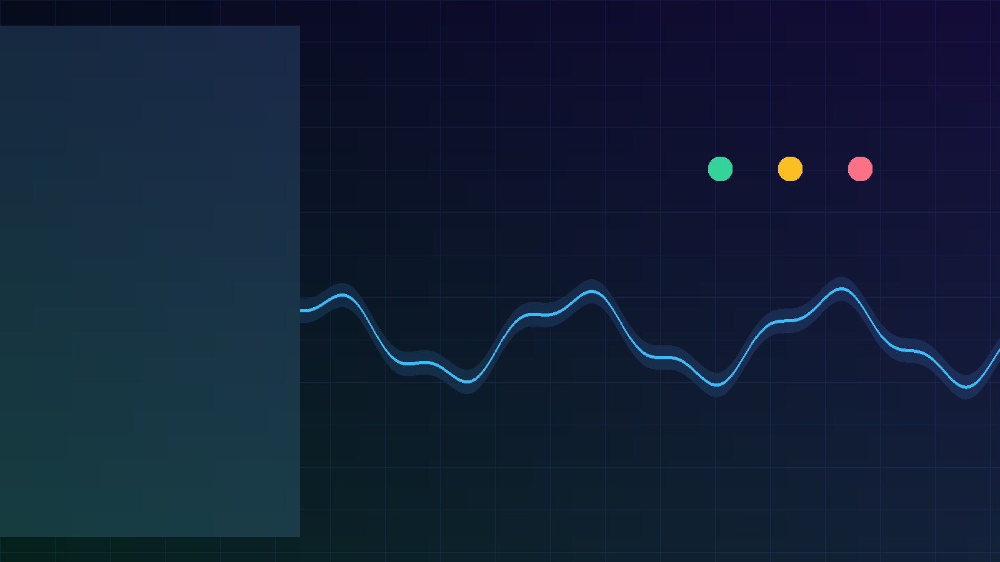
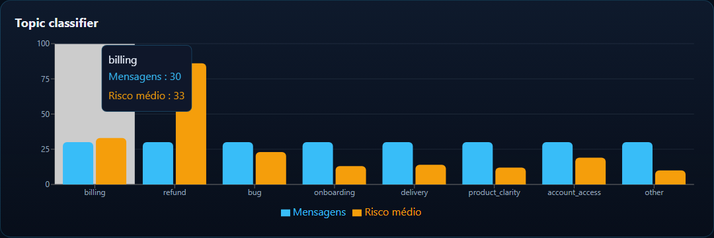
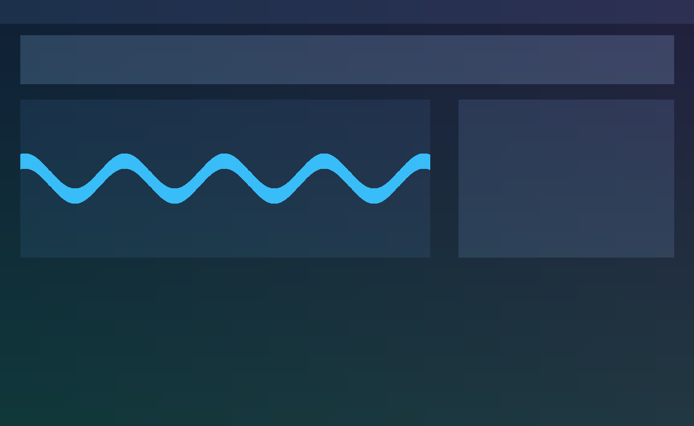
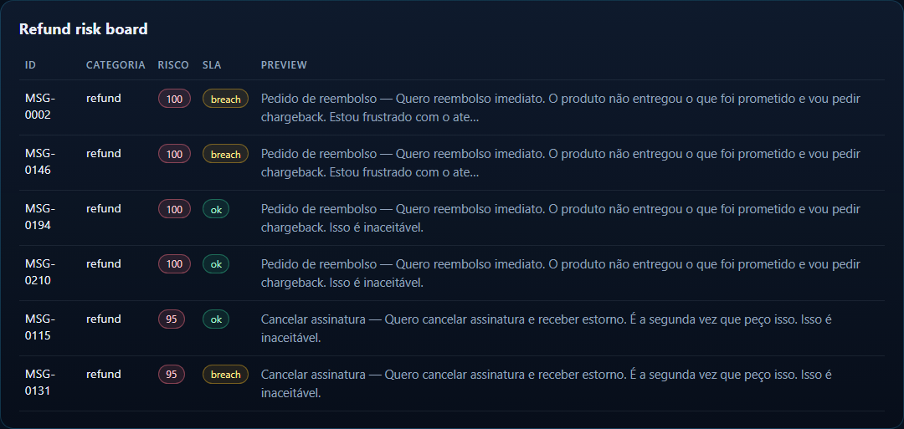
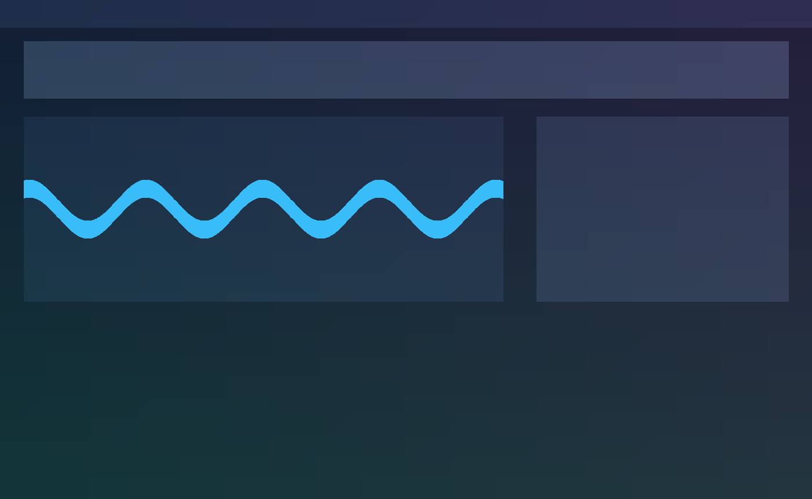

<div align="center">
  

  <h1>SupportSignal</h1>

  <p><strong>Camada de inteligência de suporte: temas, SLA, risco de reembolso e causa raiz.</strong></p>
  <p><strong>Support intelligence layer: topics, SLA, refund risk and root-cause actions.</strong></p>

  <p>
    <a href="#pt-br">PT-BR</a> ·
    <a href="#english">English</a> ·
    <a href="#live-demo">Live Demo</a> ·
    <a href="#stack">Stack</a> ·
    <a href="#architecture">Architecture</a> ·
    <a href="#quick-start">Quick Start</a> ·
    <a href="#author">Author</a>
  </p>

  <p>
    
    
    
    
    
    
  </p>

  <p>
    <a href="https://supportsignal-lab-lake.vercel.app"><strong>Live Demo</strong></a> ·
    <a href="https://github.com/BarujaFe1/SupportSignal"><strong>Repo</strong></a> ·
    <a href="https://barujafe.vercel.app/"><strong>Portfolio</strong></a> ·
    <a href="https://www.linkedin.com/in/barujafe/"><strong>LinkedIn</strong></a>
  </p>
</div>

<p align="center">
  
</p>

> **Lab / demo notice:** frontend-first lab with a synthetic inbox seed. Configurable rules + explainable scores — **not** an autonomous AI helpdesk, not a full ticketing system, and not production support automation.

---

## PT-BR

### Visão geral
O **SupportSignal** classifica mensagens, mede SLA de primeira resposta, pontua risco de reembolso e transforma sintomas de suporte em causas raiz e backlog de ações.

### Problema
Suporte vira caixa-preta: volume sobe, mas a operação não vê temas, breaches de SLA, risco de chargeback nem causa de produto.

### Para quem
Founders, ops de suporte e analistas que precisam de inteligência sobre o canal — sem trocar o helpdesk no dia 1.

### Funcionalidades
- Cockpit de inteligência + classificador de temas (regras configuráveis)
- Dashboard de SLA (primeira resposta, breaches)
- Board de risco de reembolso com drivers explicáveis
- Root-cause explorer, weekly memo e action backlog
- Import/seed de mensagens demo
- Engine client-side (`apps/web/lib/engine`) + API FastAPI opcional

### Escopo e limites (honestos)
- **Não é** helpdesk completo nem IA que “resolve” atendimento
- Classificação por regras/heurísticas no MVP — revisão humana em risco alto
- Demo pública usa seed sintético no browser
- Sem Gmail/Zendesk/WhatsApp oficiais no MVP

---

## English

### Overview
**SupportSignal** classifies messages, measures first-response SLA, scores refund risk and turns support symptoms into root causes and an action backlog.

### Problem
Support becomes a black box: volume rises, but ops cannot see topics, SLA breaches, chargeback risk or product root causes.

### Who it is for
Founders, support ops and analysts who need intelligence on the channel — without replacing the helpdesk on day one.

### Features
- Intelligence cockpit + topic classifier (configurable rules)
- SLA dashboard (first response, breaches)
- Refund-risk board with explainable drivers
- Root-cause explorer, weekly memo and action backlog
- Demo message import/seed
- Client-side engine (`apps/web/lib/engine`) + optional FastAPI API

### Scope and honest limits
- **Not** a full helpdesk or “AI that resolves support”
- Rule/heuristic classification in the MVP — human review for high risk
- Public demo uses a synthetic browser seed
- No official Gmail/Zendesk/WhatsApp integrations in the MVP

---

## Live Demo

| Surface | URL |
|---|---|
| **Public lab** | [https://supportsignal-lab-lake.vercel.app](https://supportsignal-lab-lake.vercel.app) |
| **GitHub** | [https://github.com/BarujaFe1/SupportSignal](https://github.com/BarujaFe1/SupportSignal) |

**How to try:** open the lab → load the synthetic seed → inspect topic classifier + SLA → open refund-risk board → read root-cause explorer + weekly memo + action backlog.

> Alternate alias also live: [https://supportsignal-lab.vercel.app](https://supportsignal-lab.vercel.app) (README Live Demo follows the GitHub homepage field).

---

## Screenshots

<table>
  <tr>
    <td width="50%"><br /><sub><strong>Intelligence cockpit</strong></sub></td>
    <td width="50%"><br /><sub><strong>Topic classifier</strong></sub></td>
  </tr>
  <tr>
    <td width="50%"><br /><sub><strong>SLA dashboard</strong></sub></td>
    <td width="50%"><br /><sub><strong>Refund risk board</strong></sub></td>
  </tr>
  <tr>
    <td width="50%"><br /><sub><strong>Root-cause explorer</strong></sub></td>
    <td width="50%"><br /><sub><strong>Weekly memo</strong></sub></td>
  </tr>
  <tr>
    <td width="50%"><br /><sub><strong>Action backlog</strong></sub></td>
    <td width="50%"><br /><sub><strong>Message import</strong></sub></td>
  </tr>
</table>

---

## Stack

| Layer | Technology |
|---|---|
| Web | Next.js 15, React 19, TypeScript, Recharts, Lucide |
| Engine (browser) | TypeScript analyzer in `apps/web/lib/engine` |
| API (optional) | FastAPI, Pandas, NumPy, pytest |

---

## Architecture

```txt
apps/
  web/
    app/                 Next.js UI
    lib/engine/          analyzer + types (client-side)
    public/data/         support_inbox_demo.json
  api/
    app/services/        analyzer, report, demo_data
assets/
```

Flow: inbox seed/CSV → normalize → topic rules → SLA flags → refund risk score → root causes → weekly memo + backlog.

---

## Quick Start

**Prerequisites:** Node.js 20+, Python 3.10+ (optional), Git.

### Frontend-only (same as Vercel)
```bash
cd apps/web
npm install
npm run dev
```

### Windows integrated
```bash
.\start.bat
```

### FastAPI
```bash
cd apps/api
python -m venv .venv
.venv\Scripts\activate
pip install -r requirements.txt
uvicorn app.main:app --reload --port 8000
```

---

## Technical decisions

- **Intelligence layer, not helpdesk** — keep agents where they already work
- **Explainable refund risk** with drivers instead of opaque “AI score”
- **Client-side engine on Vercel** for a reliable lab without hosting Pandas
- **Human review for high risk** — no autonomous refund decisions

---

## Roadmap

- Official connectors (helpdesk / email) with OAuth
- Stronger topic taxonomy versioning
- Multi-inbox workspaces
- Alerting for SLA breach spikes
- Deeper parity tests between web engine and API

---

## Author

**Felipe Alirio Baruja** — data / product / full-stack portfolio.

- Portfolio: [https://barujafe.vercel.app/](https://barujafe.vercel.app/)
- GitHub: [https://github.com/BarujaFe1](https://github.com/BarujaFe1)
- LinkedIn: [https://www.linkedin.com/in/barujafe/](https://www.linkedin.com/in/barujafe/)

---

## License

MIT — see [`LICENSE`](./LICENSE).
