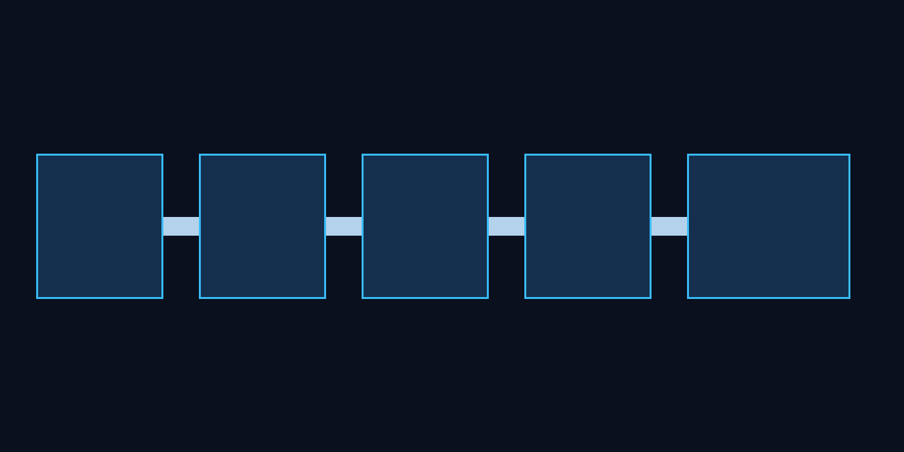

<div align="center">
  

  <h1>SupportSignal</h1>

  <p><strong>Analytics e triagem para suporte: classificação, SLA, risco de reembolso e causa raiz.</strong></p>
  <p><strong>Support intelligence: classify messages, measure SLA, score refund risk and surface root causes.</strong></p>
</div>

<p align="center">
  <a href="https://supportsignal-lab.vercel.app"><strong>🚀 Live Demo</strong></a>
  &nbsp;·&nbsp;
  <a href="https://github.com/BarujaFe1/SupportSignal"><strong>GitHub</strong></a>
</p>

> **Live demo note:** the public Vercel lab runs a **frontend-first** classifier in the browser (synthetic inbox seed). The FastAPI package remains available for local/API workflows. This is a support **intelligence lab** — **not** a helpdesk and **not** “AI that fully resolves support”.

<div align="center">
  <p>
    <a href="#1-visão-geral--overview">PT-BR / English Overview</a> •
    <a href="#-product-preview">Preview</a> •
    <a href="#-screenshots">Screenshots</a> •
    <a href="#️-stack--tecnologias">Stack</a> •
    <a href="#-arquitetura--architecture">Architecture</a> •
    <a href="#-quick-start--início-rápido">Quick Start</a> •
    <a href="#-autor--author">Author</a>
  </p>

  <p>
    
    
    
    
    
    
  </p>
</div>

<p align="center">
  
</p>

---

## 1. Visão Geral / Overview

O **SupportSignal** é um **lab MVP** de analytics e triagem para pequenas operações de suporte: classifica mensagens (regras configuráveis), mede SLA, aponta risco de reembolso e sugere ações de causa raiz a partir de um seed sintético.

A proposta não é substituir o helpdesk: é uma **camada de inteligência** em cima do suporte existente. O projeto foi desenvolvido por **Felipe Alirio Baruja** como peça de portfólio no cruzamento de dados, produto e automação pragmática com revisão humana.

> **Intelligence Layer Notice**  
> O SupportSignal prioriza classificação configurável, métricas operacionais e filas de risco com revisão humana. Ele **não** promete “IA que resolve suporte”, automação total de atendimento nem substitui um helpdesk completo.

---

## ✨ Product Preview

<p align="center">
  
</p>

O SupportSignal apresenta uma inbox analítica focada em operação: temas dominantes, SLA, board de risco de reembolso, explorer de causa raiz e memo semanal com ações recomendadas.

---

## 2. Por que este projeto importa? / Why this project matters

* **Suporte vira caixa-preta:** Mensagens acumulam sintomas de cobrança confusa, onboarding ruim, bugs e entrega atrasada — mas a operação só vê volume.
* **Retrabalho e churn escondidos:** Sem classificação e risco, o time apaga incêndio sem atacar causa raiz.
* **IA com pragmatismo:** O MVP usa regras configuráveis e scores explicáveis; risco alto exige revisão humana.
* **Diferenciação clara:** Não é mais um helpdesk. É inteligência operacional sobre o canal que o time já usa.

---

## 🧠 O diferencial do SupportSignal / What makes SupportSignal different

### Português
O SupportSignal não tenta ser a ferramenta onde o agente responde tickets. Ele mostra:
- quais temas dominam a fila;
- onde o SLA quebra;
- quais mensagens cheiram a reembolso/chargeback;
- qual causa raiz merece backlog de produto;
- quais ações cabem no memo semanal do founder.

### English
SupportSignal is not another agent inbox. It shows:
- which topics dominate the queue;
- where SLA breaks;
- which messages look like refund/chargeback risk;
- which root causes deserve a product backlog item;
- which actions belong in the founder’s weekly memo.

---

## 🎯 Problema que resolve / The problem it solves

Em operações reais de suporte (100–5.000 mensagens/mês), é comum:
- atender no Gmail/WhatsApp/helpdesk simples sem visão agregada;
- repetir as mesmas explicações sem medir causa;
- descobrir churn/reembolso tarde demais;
- não ter SLA confiável de primeira resposta;
- misturar sintoma (“cliente bravo”) com causa (“onboarding quebrado”).

O **SupportSignal** cria uma camada auditável entre a mensagem bruta e a decisão operacional.

---

## 🧩 Proposta / Analytical Pipeline

```txt
CSV / Demo Inbox / (future) Gmail·Zendesk·WhatsApp
  ↓
Parsing e normalização de mensagens
  ↓
Classificação por categoria (regras configuráveis)
  ↓
Sentimento / urgência
  ↓
SLA de primeira resposta + breach flags
  ↓
Refund risk score explicável
  ↓
Root-cause explorer + temas emergentes
  ↓
Weekly memo + action backlog
```

---

## 📸 Screenshots

<table>
  <tr>
    <td width="50%">
      
      <br />
      <sub><strong>Topic Classifier</strong> — categorias, volume e risco médio por tema.</sub>
    </td>
    <td width="50%">
      
      <br />
      <sub><strong>SLA Dashboard</strong> — primeira resposta, breaches e fila aberta.</sub>
    </td>
  </tr>
  <tr>
    <td width="50%">
      
      <br />
      <sub><strong>Refund Risk Board</strong> — watchlist com score e drivers explicáveis.</sub>
    </td>
    <td width="50%">
      
      <br />
      <sub><strong>Root-Cause Explorer</strong> — temas ligados a hipóteses de causa operacional.</sub>
    </td>
  </tr>
  <tr>
    <td width="50%">
      
      <br />
      <sub><strong>Weekly Support Memo</strong> — resumo executivo para founder/CS.</sub>
    </td>
    <td width="50%">
      
      <br />
      <sub><strong>Action Backlog</strong> — P0/P1/P2 com owner hint e racional.</sub>
    </td>
  </tr>
</table>

<p align="center">
  
</p>

---

## 📌 Estudo de Caso / Case Study

### 📌 Estudo de Caso: Inbox sintética de SaaS/e-commerce
A base demo simula **240 mensagens** em e-mail, WhatsApp e formulário, cobrindo cobrança, reembolso, bugs, onboarding, entrega, clareza de produto e acesso. O SupportSignal classifica temas, calcula SLA, monta a fila de alto risco e gera um memo semanal com ações.

### 📌 Case Study: Synthetic SaaS/e-commerce inbox
The demo dataset simulates **240 messages** across email, WhatsApp and forms covering billing, refunds, bugs, onboarding, delivery, product clarity and account access. SupportSignal classifies topics, computes SLA, builds the high-risk queue and produces a weekly memo with actions.

---

## 🧭 Visual Story / Jornada Analítica

```txt
1. Carregar inbox demo (CSV sintético)
2. Ler cockpit: volume, abertas, alto risco
3. Inspecionar topic classifier e temas emergentes
4. Medir SLA e breaches
5. Abrir refund risk board (score ≥ 70)
6. Explorar causa raiz por categoria
7. Ler weekly memo
8. Priorizar action backlog (P0–P2)
```

---

## ⚙️ Funcionalidades Principais / Core Features

### Message Import
Importação de CSV/demo com campos de mensagem, canal, timestamps e status. Upload endpoint preparado para CSV do operador.

### Topic Classifier
Classificação heurística configurável por dicionários de palavras-chave (MVP), com caminho claro para modelos assistidos + revisão humana.

### SLA Dashboard
Tempo até primeira resposta, taxa de breach e mensagens abertas sem resposta.

### Refund Risk Board
Score 0–100 com drivers (categoria, sentimento, urgência, linguagem de chargeback, contato repetido).

### Root-Cause Explorer
Mapeia categorias para hipóteses de causa operacional acionáveis por produto/CS.

### Weekly Support Memo
Resumo executivo + watchlist + ações recomendadas + caveats explícitos.

### Action Backlog
Backlog priorizado para reduzir retrabalho e atacar o que está quebrando na operação.

---

## 🛠️ Stack / Tecnologias

### Frontend
- **Framework:** Next.js 15 (App Router) & React 19
- **Linguagem:** TypeScript
- **Gráficos:** Recharts
- **Ícones:** Lucide Icons

### Backend
- **Framework API:** FastAPI & Uvicorn (Python 3.12)
- **Modelagem:** Pydantic v2
- **Dados:** Pandas
- **Testes:** Pytest

### Produto / Ops (roadmap)
- Supabase, filas, Gmail API, Stripe/Mercado Pago, PostHog, Sentry

---

## 🧱 Arquitetura / Architecture

```text
SupportSignal/
├── apps/
│   ├── web/                         # Frontend Next.js (App Router)
│   │   ├── app/                     # Página principal do cockpit
│   │   ├── components/              # TopicChart e UI analítica
│   │   ├── lib/                     # API client
│   │   └── types/                   # Tipos TypeScript
│   │
│   └── api/                         # Backend FastAPI
│       ├── app/
│       │   ├── api/                 # /demo /analyze /report /methodology
│       │   ├── models/              # Schemas Pydantic
│       │   └── services/            # classifier, SLA, risk, memo
│       └── tests/                   # Pytest
│
├── data/
│   └── seed/                        # support_inbox_demo.csv
│
├── docs/                            # Pitch, roadmap, metodologia
├── assets/                          # Ícone, hero, screenshots
├── scripts/                         # generate_assets_and_seed.py
├── start.bat                        # Inicializador Windows
└── README.md
```

---

## 🧱 Visual Architecture

<p align="center">
  
</p>

SupportSignal follows a traceable support-intelligence flow: raw messages enter, get classified, scored for SLA/risk, aggregated into root causes and exported as memo/actions.

---

## 🔁 Data Flow Pipeline

```txt
Raw Messages (CSV / Demo)
  ↓
Normalize channels & timestamps
  ↓
Category classification (configurable rules)
  ↓
Sentiment + urgency heuristics
  ↓
SLA computation & breach flags
  ↓
Refund risk scoring (explainable drivers)
  ↓
Topic aggregation + emerging themes
  ↓
Weekly memo / Action backlog / Dashboard
```

---

## 🚀 Quick Start / Início Rápido

### Live Demo
Abra o lab publicado: **[https://supportsignal-lab.vercel.app](https://supportsignal-lab.vercel.app)**

Checklist rápido na demo:
1. Banner lab + aviso de escopo (não é helpdesk / não é IA autônoma)
2. One-click: carregar seed sintético (240 msgs)
3. Ver topic classifier + SLA
4. Abrir refund risk board (score ≥ 70)
5. Ler root-cause explorer + weekly memo + action backlog

### Pré-requisitos (local)
- **Node.js** v20 ou superior
- **Python** v3.10+ (preferencialmente 3.12) — opcional, só para API
- **Git**

### Opção 1 — Lab frontend-first (mesmo modo da Vercel)
```bash
cd apps/web
npm install
npm run dev
```
*Lab em [http://localhost:3000](http://localhost:3000). A classificação roda no browser com `public/data/support_inbox_demo.json`.*

### Opção 2 — Execução integrada no Windows (web + FastAPI)
```bash
start.bat
```
Sobe API em `:8000`, web em `:3000` e abre o navegador.

### Opção 3 — Backend FastAPI (`apps/api`)
```bash
cd apps/api
python -m venv .venv
.venv\Scripts\activate            # Windows
source .venv/bin/activate          # Linux/macOS
pip install -r requirements.txt
uvicorn app.main:app --reload --port 8000
```

### Gerar seed e assets (se necessário)
```bash
python scripts/generate_assets_and_seed.py
```

---

## 🧪 Scripts e Testes / Scripts and Testing

```bash
cd apps/api
.venv\Scripts\python -m pytest
```

```bash
cd apps/web
npm run lint
npm run typecheck
npm run build
```

---

## 🛡️ Segurança, privacidade e boas práticas

* Previews mascaram e-mails no dashboard.
* Dataset demo é sintético e anonimizado.
* `.env` real fica fora do Git (`.env.example` apenas).
* Alto risco de reembolso exige revisão humana.
* MVP não envia respostas automáticas a clientes.

---

## 🧭 Roadmap do Produto

* **MVP:** import CSV/demo, classifier, SLA, refund risk, root-cause, weekly memo
* **Fase 2:** conectores Gmail/Zendesk/Intercom/WhatsApp, alertas, replies sugeridas
* **Fase 3:** workflow de melhoria de produto, roteamento, near-real-time, benchmarking

Detalhes em [docs/product_roadmap.md](./docs/product_roadmap.md).

---

## 💼 Valor para Portfólio / Portfolio Value

O SupportSignal demonstra:
- produto B2B com tese de monetização por volume;
- NLP/classificação aplicada com pragmatismo;
- analytics operacional acionável;
- UX de inteligência (não só gráficos);
- disciplina de não prometer helpdesk completo.

---

## 📚 Documentação Complementar

- [docs/portfolio_pitch.md](./docs/portfolio_pitch.md) — pitch e roteiro de demo
- [docs/product_roadmap.md](./docs/product_roadmap.md) — fases e non-goals
- [docs/technical_methodology.md](./docs/technical_methodology.md) — classificação, SLA e risco

---

## 🖼️ GitHub Social Preview

```txt
assets/social-preview.png
```
Dimensão recomendada: 1280x640. Upload em Repository Settings → Social Preview.

---

## 🔖 GitHub Repository Metadata

### About sugerido
```txt
Support intelligence layer: classify messages, measure SLA, score refund risk and turn support symptoms into root-cause actions.
```

### Topics sugeridos
```txt
support-analytics
customer-support
sla
refund-risk
root-cause-analysis
fastapi
nextjs
typescript
python
portfolio-project
b2b-saas
text-classification
operational-analytics
```

---

## 👤 Autor / Author

Desenvolvido por **Felipe Alirio Baruja**.

- **Portfolio:** [barujafe.vercel.app](https://barujafe.vercel.app/)
- **GitHub:** [@BarujaFe1](https://github.com/BarujaFe1)
- **LinkedIn:** [Gustavo Felipe Alirio Baruja](https://www.linkedin.com/in/barujafe/)

---

## 📄 Licença / License

MIT License. Copyright (c) 2026 Felipe Alirio Baruja.
O código está disponível sob a licença MIT caso o arquivo `LICENSE` esteja presente no repositório.
